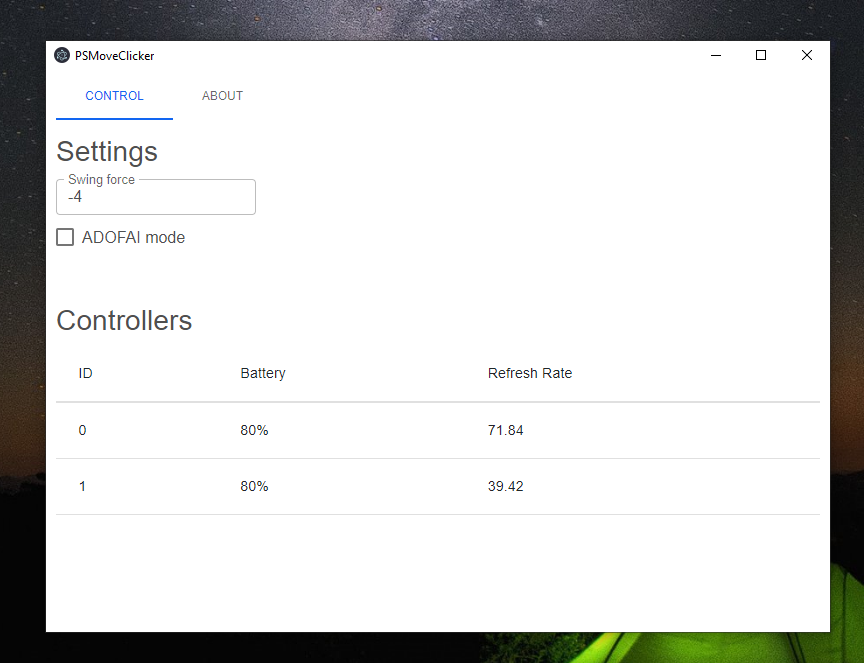

# PSMoveClicker-electron

## Please note that GNU/Linux support is under development in `v2` branch using [psmoveapi](https://github.com/thp/psmoveapi).

Program was primarly made for ADOFAI, but you can use it as a mouse.

Btw I'm not responsible for breaking your PSMove (it shouldn't happen as long as you keep the force close to 0)

## Usage

This program works with [PSMoveService](https://github.com/psmoveservice/PSMoveService), but I recommend using [PSMoveServiceEx](https://github.com/Timocop/PSMoveServiceEx/)  
You need to run it with this program

### Controller usage

- Cross button - Left Mouse Button - supports holding
- Circle button - Right Mouse Button - supports holding
- Select button - Escape Button - supports holding
- T button - Mouse cursor
- PS Button - Sets main controller in ADOFAI mode
- Swinging - Clicks

### Control panel usage

- Swing force - Sets force of the swing (default -4, you should keep this negative)
- ADOFAI mode - Fixes multiple clicks at once in ADOFAI (noticeable in levels like [Fear Grows](https://www.youtube.com/watch?v=LyX6_KqIwwU))
- Clicking on controller info - Will "blink" the controller

### Geometry Dash?

No.

## Building

### Installing

- Copy this repo
- `npm i` (takes a lot of time btw, because React)

### Developing

run `npm run start`

If you are changing PSMoveClickerAPI library, you can build it with buildPSMoveClickerAPI.bat or `npx node-gyp configure build`

### Building (packaging)

run `npm run build`, this will build everything (PSMoveClickerAPI, React, Electron, copy PSMoveClient_CAPI.dll file)  
Packaged app will be in dist/win-unpacked
